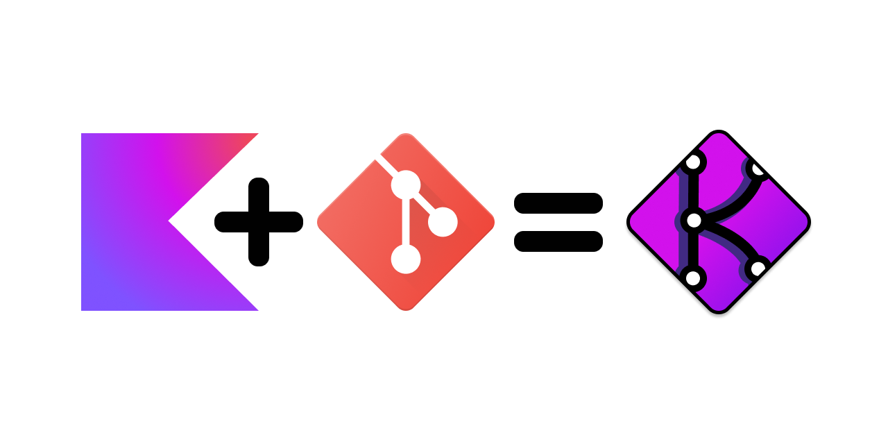
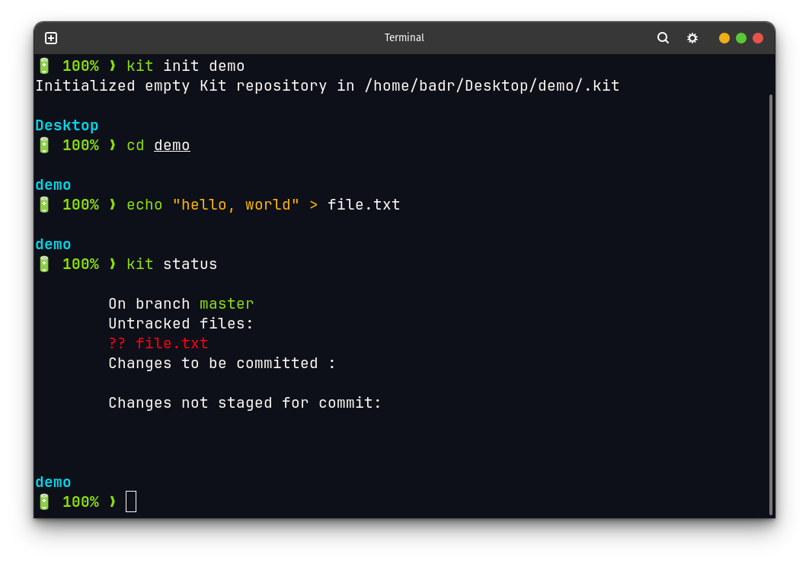
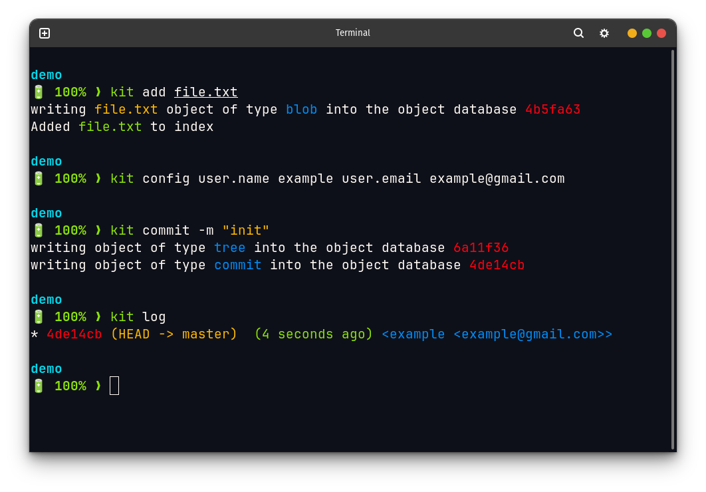
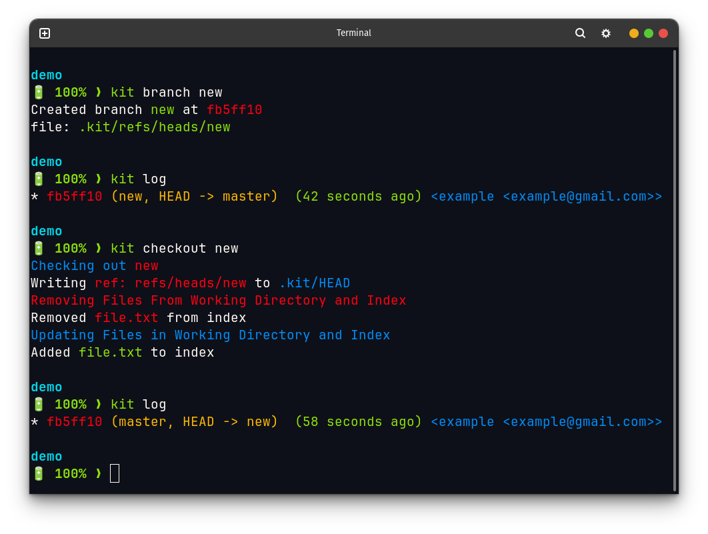
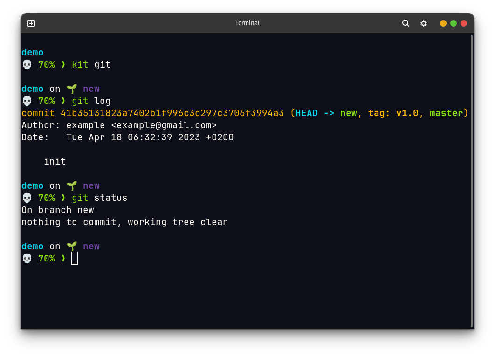
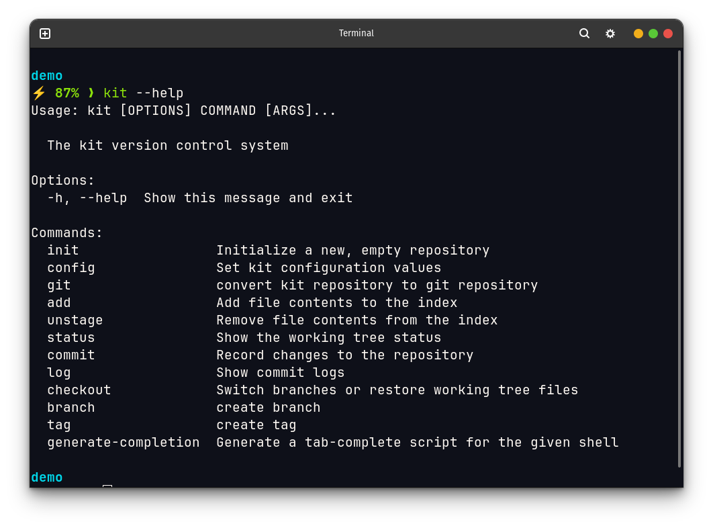

# Git A Home-Made Recipe With Kotlin

    

## About

This Project is My Attempt To Reimplement Git With Kotlin.
  Why? I See You Wandering... Why Not?\
I've Been Reading About Git For Quite Some Time And have Explained It To Many Of My Peers.\
And While I Was Learning Kotlin With JetBrains Academy, One Of The Projects Was About Version Control System, especially
Git, But The Implementation Level Wasn't That Interesting, After That I came Across [CodeCrafters](https://codecrafters.io/),
They have modules for building some projects with theme `Build Your Own`, and one of them was `Build Your Own Git`,
but it didn't also catch my attention, and they didn't have a kotlin version, so I decided to implement it myself, and make it compatible with git and I named it `kit (kotlin implementation of git).`\
my intention for this project was to learn more about git, and build a decent project with kotlin considering that it's my favorite language.\
also I'm not implementing the whole git, I'm just implementing the core features of git, and I'm not implementing it in the best way, I'm just trying to implement it in a way that I can understand it, and hopefully others can understand it too.
so it's **an educational project**, also if you want to contribute, you're welcome.

## Features

git have two types of commands:
- **Low Level Commands ie plumbing commands**: these commands are the core commands of git, and they are the commands that git uses to implement the high level commands, you rarely use these commands directly, but you can use them if you want to.
- **High Level Commands ie porcelain commands**: these commands are the commands that the user uses to interact with git.

git model is based on four objects:
- **Blob**: a blob is a file, it's the smallest unit of git, it's the content of a file.
- **Tree**: a tree is a directory, it's a collection of blobs and trees.
- **Commit**: a commit is a snapshot of the repository, it's a collection of trees and blobs.
- **Tag**: a tag is a label for a commit, it's a pointer to a commit.

I'll be implementing plumbing commands at first, then I'll implement porcelain commands.

### Next
- Add more prints to display what's going on in these commands:
  - [ ] init
  - [ ] checkout
  - [ ] branch

## Plumbing Commands
- [x] hash-object
- [x] cat-file
- [x] update-index
- [x] write-tree
- [x] commit-tree
- [x] ls-files

## Porcelain Commands
- [x] init
- [x] add
- [x] unstage
- [x] commit
- [x] log
- [x] status
- [x] checkout
- [x] branch
- [x] config
## Screenshots

### Init a repo creating a file and checking status

    

### Adding file to index and configuring user then commiting and log to see the commit

    

### Create a branch and checkout to it

    

### Convert repo to git repo

    

### Help

    

